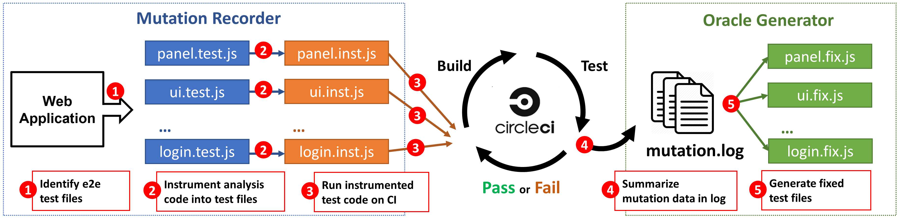

# WEFix

WEFix is an automated tool that can fix concurrency flakiness in web e2e testing. It inserts analysis code into the original e2e test files, and after collecting runtime mutation information, it can generate appropriate explicit waits after command statements to solve flakiness. The following graph shows the workflow of WEFix. WEFix is composed of two parts: Mutation Recorder and Oracle Generator. 

We make our tool available on [NPM](https://www.npmjs.com/package/@wefix-tech/wefix), where Node.js users can easily download and integrate it into their web projects. Moreover, this tool includes a user-friendly UI panel to help developers fix web e2e flaky tests. The tool source code can be found on [GitHub](https://github.com/WEFix-tech/WEFix) under the MIT licence.

## Dataset

#### Web_e2e_repos_Dec_14_2021.xlsx
In the paper, we collected 100,000 top-star JavaScript repositories from GitHub using GitHub Search API. We filtered out 250 repos containing web e2e testing and stored them in this file. This data is collected on December 14th, 2021. Repositories are listed in descending order of star number. We identify e2e testing by searching e2e keywords in the repo's `package.json` file. The matched e2e keywords of each repo are presented in the ''e2e keyword'' column.

<iframe src="https://docs.google.com/spreadsheets/d/e/2PACX-1vS5ZE44hEsM4pQxB8k8Nm6Iz66EsIzes4ZtYjJfNuWKqW32Ku_c_Lk4JY7K0x9nWXK2dpeZqFWtPOCa/pubhtml?gid=0&amp;single=true&amp;widget=true&amp;headers=false" loading allowfullscreen width="100%" height="300"></iframe>

#### Exp_repos.xlsx
This file contains the information of seven web application repositories used in our experiment. We picked them out from 250 repos because they have high stars and are easy to deploy. The "SHA" column shows the commit version we used.

<iframe src="https://docs.google.com/spreadsheets/d/e/2PACX-1vS5ZE44hEsM4pQxB8k8Nm6Iz66EsIzes4ZtYjJfNuWKqW32Ku_c_Lk4JY7K0x9nWXK2dpeZqFWtPOCa/pubhtml?gid=759038802&amp;single=true&amp;widget=true&amp;headers=false"  loading allowfullscreen width="100%" height="300"></iframe>

## How to reproduce the experiment result 

1. Clone the repository from GitHub. Make sure Node.js is installed.
2. Run `npm install` or `yarn` to install necessary dependencies for the project.
3. Run `npm install --save-dev wefix` or `yarn add --dev wefix` to add our tool WEFix as the development dependency.
4. Mannually remove all wait statements in all e2e test files. So that all concurrency flakiness is exposed.
5. Run `npx wefix -i` or `yarn wefix -i`. WEFix will detect all e2e test files under current directory and instrument analysis code into them.
6. Check the `package.json` file, and start build process using pre-defined npm command, such as `npm run build`.
7. Start the application using pre-defined npm command, such as `npm run start:app`. The seven repos used in our paper will start a local server. Make sure you can visit its web page through localhost.
8. Run the e2e testing using pre-defined npm command, such as `npm run test:e2e`. For Cypress, you need to add `--config defaultCommandTimeout=0` parameter to disable its inherent auto-wait ability. After the testing process finish, a local file named `mutation.log` will be generated, which contains mutation information of each commands recorded on the fly.
9. (Optional) Run `npx wefix ui` or `yarn wefix ui`. WEfix will start a web page on localhost as UI panel, where all the mutations are presented in order. This UI panel could help users better understand the DOM behavior during test runtime and fix the flakiness.
10. Run `npx wefix -f` or `yarn wefix -f`. WEfix will take `mutation.log` as input to insert generated fix code into the original test files. 
11. Manually rerun fixed e2e tests ten times and check whether the flakiness disappeared.

## Experiment Result

#### Exp_result.xlsx
In the paper, we apply WEFix on seven repos in [Exp_repos.xlsx](https://wefix-tech.github.io/#dataset). The fix result and overhead breakdowns are shown in this table.

<iframe src="https://docs.google.com/spreadsheets/d/e/2PACX-1vS5ZE44hEsM4pQxB8k8Nm6Iz66EsIzes4ZtYjJfNuWKqW32Ku_c_Lk4JY7K0x9nWXK2dpeZqFWtPOCa/pubhtml?gid=2093927333&amp;single=true&amp;widget=true&amp;headers=false"  loading allowfullscreen width="100%" height="400"></iframe>
